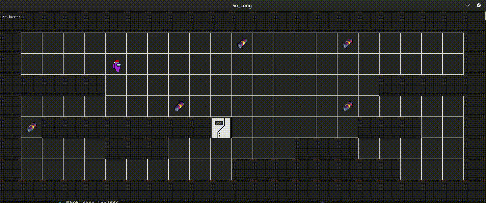

# So_Long

## Visão Geral

So_Long é um envolvente projeto de mini game desenvolvido com o objetivo principal de utilizar a [biblioteca Mlx](https://github.com/42Paris/minilibx-linux) fornecida pela 42. O projeto envolve a criação de um jogo baseado em um mapa fornecido pelo usuário que inclui paredes, itens colecionáveis, a posição inicial do personagem e uma saída. Este projeto foi uma jornada gratificante, exigindo experimentação, a criação de funções personalizadas e a exploração de vários conceitos para alcançar o resultado final.

## Screenshots



## Exemplo de Mapa


## Recursos

- **Customização de Mapa:** Os usuários podem definir mapas com paredes, itens colecionáveis, a posição inicial do personagem e a saída.
- **Jogabilidade Interativa:** Os jogadores podem navegar pelo mapa, coletar itens e chegar à saída para completar o jogo.
- **Gráficos com Mlx:** O jogo aproveita a biblioteca Mlx para criar uma interface gráfica.

## Instalação

Para executar o So_Long em sua máquina, siga estas etapas:

1. Clone o repositório:

   ```bash
   git clone https://github.com/your_username/So_Long.git
   cd So_Long
   make
   ./so_long caminhodomapa
